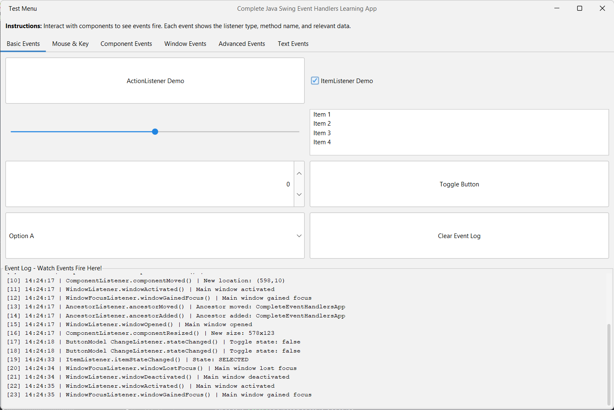
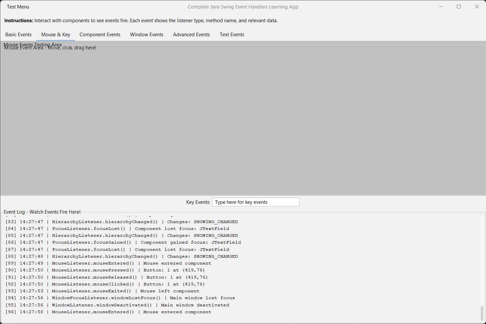
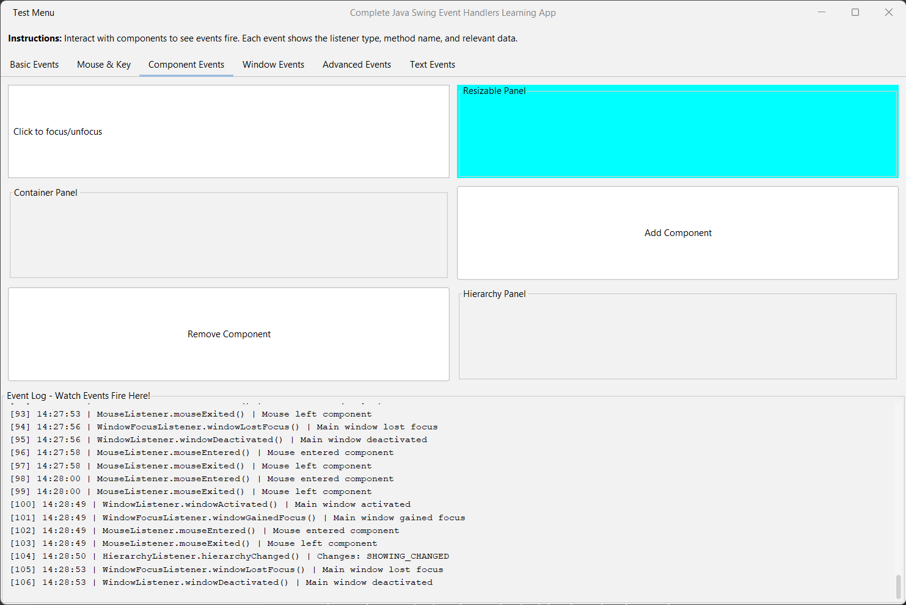
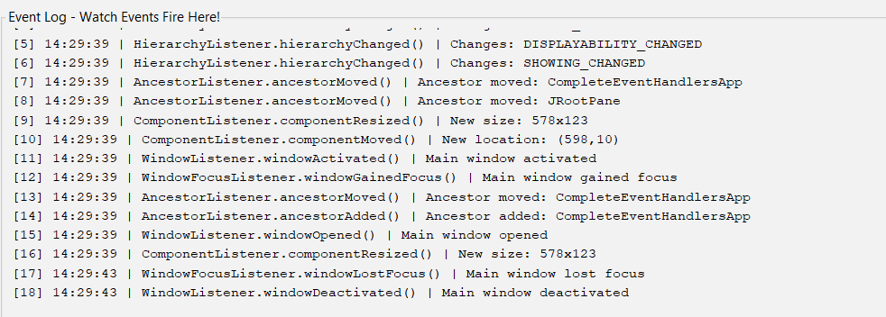

# 🎯 Java GUI Event Listener Learning Application

[](https://creativecommons.org/licenses/by-nc/4.0/)
[](https://www.oracle.com/java/)
[](https://docs.oracle.com/javase/tutorial/uiswing/)
[](https://www.formdev.com/flatlaf/)

> **A comprehensive, interactive learning application for understanding all Java Swing event handlers and listeners.**

This application demonstrates **30+ event listener interfaces** with **70+ methods** in a hands-on, educational environment. Perfect for students, educators, and developers learning Java GUI programming.

---

## 📸 Screenshots

<table>
  <tr>
    <td><br/><em>Basic Events - ActionListener, ItemListener, ChangeListener</em></td>
    <td><br/><em>Mouse & Key Events - Interactive testing area</em></td>
  </tr>
  <tr>
    <td><br/><em>Component Events - Focus, Resize, Container changes</em></td>
    <td><br/><em>Real-time Event Log - Track every event fired</em></td>
  </tr>
</table>

---

## ✨ Features

### 🎓 Educational Design
- **Real-time Event Logging**: See exactly which listener fires, which method is called, and what data is passed
- **Comprehensive Documentation**: Every listener includes detailed comments explaining:
  - What triggers the event
  - When to use it
  - Common use cases
  - Example implementations
- **Interactive Components**: All UI elements are designed to demonstrate their associated events
- **Organized Layout**: 6 themed tabs categorizing events by functionality

### 🔍 Complete Event Coverage

#### **Basic Event Listeners** (Tab 1)
- ✅ `ActionListener` - Button clicks, menu selections, Enter key actions
- ✅ `ItemListener` - Checkbox, radio button, combobox state changes
- ✅ `ChangeListener` - Slider, spinner, progress bar value changes
- ✅ `ListSelectionListener` - JList selection changes
- ✅ `ButtonModel ChangeListener` - Advanced button state tracking

#### **Mouse & Keyboard Events** (Tab 2)
- ✅ `MouseListener` (5 methods) - Click, press, release, enter, exit
- ✅ `MouseMotionListener` (2 methods) - Drag and move tracking
- ✅ `MouseWheelListener` - Mouse wheel scroll events
- ✅ `KeyListener` (3 methods) - Key press, release, and typed

#### **Component Lifecycle Events** (Tab 3)
- ✅ `FocusListener` (2 methods) - Focus gained/lost
- ✅ `ComponentListener` (4 methods) - Resize, move, show, hide
- ✅ `ContainerListener` (2 methods) - Component add/remove
- ✅ `HierarchyListener` - Component hierarchy changes
- ✅ `AncestorListener` (3 methods) - Ancestor add, remove, move

#### **Window Events** (Tab 4)
- ✅ `WindowListener` (7 methods) - Open, close, iconify, activate, etc.
- ✅ `WindowFocusListener` (2 methods) - Window focus gained/lost
- ✅ `WindowStateListener` - Window state changes (minimize, maximize)
- ✅ `InternalFrameListener` (7 methods) - Internal frame lifecycle

#### **Advanced UI Events** (Tab 5)
- ✅ `TreeSelectionListener` - JTree node selection
- ✅ `TreeExpansionListener` (2 methods) - Tree expand/collapse
- ✅ `TreeWillExpandListener` (2 methods) - Pre-expansion veto capability
- ✅ `TableModelListener` - Table data changes
- ✅ `MenuListener` (3 methods) - Menu selected, deselected, canceled
- ✅ `PopupMenuListener` (3 methods) - Popup visibility and cancel
- ✅ `PropertyChangeListener` - Bean property changes

#### **Text & Document Events** (Tab 6)
- ✅ `DocumentListener` (3 methods) - Text insert, remove, attribute changes
- ✅ `UndoableEditListener` - Undoable edit tracking
- ✅ `CaretListener` - Text caret position changes
- ✅ `HyperlinkListener` - Hyperlink interactions

### 🛠️ Additional Features
- **Event Counter**: Track the total number of events fired
- **Timestamps**: See when each event occurred
- **Clear Log Function**: Reset the event log anytime
- **Test Windows**: Create separate windows to test window events
- **Dynamic Components**: Add/remove components to see container events
- **Modern UI**: Clean, professional interface with FlatLaf theme

---

## � Download & Installation

### Option 1: Use Platform-Specific Installers (Recommended)
Download the latest installer for your platform from our [Releases](../../releases) page. These installers include Java Runtime Environment (JRE) 21, so no separate Java installation is needed!

**Windows**
- Download `EventListenersDemo-windows.exe`
- Run the installer
- Choose your installation location (defaults to `C:\Program Files\EventListenersDemo`)
- Launch from:
  - Start Menu → EventListenersDemo
  - Desktop shortcut
  - `C:\Program Files\EventListenersDemo\EventListenersDemo.exe`

**Linux (Debian/Ubuntu)**
```bash
sudo apt install ./EventListenersDemo-linux.deb
# Launch from Applications menu or terminal:
EventListenersDemo
```

**macOS**
- Download `EventListenersDemo-macos.dmg`
- Open the DMG file
- Drag EventListenersDemo to Applications
- Launch from Applications folder or Spotlight

### Option 2: Standalone JAR (For Advanced Users)
If you prefer a portable option and already have Java 8 or newer installed:

1. Download `EventListenersDemo-standalone.jar` from [Releases](../../releases)
2. Run with:
```bash
java -jar EventListenersDemo-standalone.jar
```

**Note for HiDPI Displays**: If using Java 8 and text appears too small:
```bash
java -Dsun.java2d.uiScale=1.75 -Dflatlaf.uiScale=1.75 -jar EventListenersDemo-standalone.jar
```

### Option 3: Get Latest Development Builds
1. Go to [Actions](../../actions) tab
2. Click the latest successful workflow run
3. Download the artifact for your platform from:
   - `installer-windows`
   - `installer-linux`
   - `installer-macos`
   - `standalone-jar`

### Option 4: Build and Run in NetBeans (recommended)
1. Open the project folder in NetBeans.
2. Build/Run using NetBeans (Run ▶). NetBeans uses the provided `build.xml` and project metadata.
3. NetBeans will produce a runnable JAR in `dist/` (ignored by Git).

### Option 5: Build with Ant (CLI)
If you have Ant installed, you can use the NetBeans build script:

```powershell
# From the project root (PowerShell)
ant clean jar

# Run the generated JAR
java -jar .\dist\javaGuiEventListenerDemo.jar
```

Notes
- If you run the JAR with an older Java (e.g., 8) on HiDPI displays and see small UI text, you can either run with a newer JDK (17+) or pass a UI scale VM option, for example:
```powershell
java -Dsun.java2d.uiScale=1.75 -Dflatlaf.uiScale=1.75 -jar .\dist\javaGuiEventListenerDemo.jar
```
   Adjust the scale value (1.25–2.0) to taste.

---

## 🏗️ Repository Layout

This reflects the actual folders in this repository. Items ignored by Git (per `.gitignore`) are marked with [ignored].

```
java-gui-event-listener-demo/
│
├── build.xml                      # NetBeans/Ant build script
├── LICENCE                        # CC BY-NC 4.0 license
├── manifest.mf                    # JAR manifest
├── README.md
│
├── build/               [ignored] # Local build output (not tracked)
│   └── classes/
│
├── lib/                          # NetBeans libraries/config
│   ├── nblibraries.properties
│   └── CopyLibs/
│
├── nbproject/                    # NetBeans project metadata
│   ├── build-impl.xml
│   ├── genfiles.properties
│   ├── project.properties
│   ├── project.xml
│   └── private/         [ignored]
│
├── screenshots/                  # Application screenshots
│   └── ...
│
├── src/
│   └── javaGuiEventListenersDemo/
│       └── CompleteEventHandlersApp.java  # Main application
│
└── test/
```

### What’s tracked vs. ignored
From `.gitignore`, these are not tracked by Git and won’t appear in commits:
- NetBeans private config: `nbproject/private/`
- Build outputs: `/build/`, `/dist/`, `nbbuild/`, `nbdist/`
- Compiled classes: `*.class`
- Logs/backups: `/logs/`, `*.log`, `*.bak`, `*~`, `*.swp`
- System files: `.DS_Store`, `Thumbs.db`

---

## 🔧 Technologies Used

| Technology | Purpose | Version |
|------------|---------|---------|
| **Java** | Core programming language | 8+ |
| **Swing** | GUI framework | Built-in |
| **AWT** | Event handling framework | Built-in |
| **FlatLaf** | Modern look and feel theme | Latest |
| **NetBeans + Ant** | Build/run scripts | Provided |

### Build & Distribution
- **Automated Builds**: GitHub Actions workflow creates installers for all platforms
- **Runtime**: Java 8+ compatible (standalone JAR)
- **Installers**: Bundled with JRE 21 for hassle-free installation
- **CI/CD**: Automatic releases on version tags
- **Artifacts**: Available via GitHub Releases and Actions


### Why FlatLaf?
[FlatLaf](https://www.formdev.com/flatlaf/) is a modern, flat design look and feel for Java Swing applications. It provides:
- ✨ Contemporary, professional appearance
- 🎨 Better aesthetics than default Swing themes
- 📱 Consistency across different operating systems
- ⚡ Excellent performance

---

## 📚 Learning Guide

### How to Use This Application

1. **Start with Basic Events Tab**
   - Click buttons, check boxes, move sliders
   - Watch the event log to see which events fire
   - Notice the method names and parameters

2. **Explore Mouse & Key Events**
   - Move your mouse over the test area
   - Click, drag, and use the mouse wheel
   - Type in the text field to see keyboard events

3. **Test Component Events**
   - Focus on different text fields
   - Resize the window to see component events
   - Add and remove components dynamically

4. **Experiment with Window Events**
   - Create new test windows
   - Minimize, maximize, and restore windows
   - Switch between windows to see focus events

5. **Try Advanced Features**
   - Expand/collapse tree nodes
   - Edit table data
   - Interact with menus and popups
   - Monitor property changes

6. **Work with Text Events**
   - Edit text areas to see document events
   - Move the text caret
   - Use undo/redo functionality

### Understanding Event Listeners

**Event listeners follow the Observer pattern:**
1. A component (subject) maintains a list of listeners (observers)
2. When an event occurs, the component notifies all registered listeners
3. Each listener receives an event object with detailed information

**Example:**
```java
button.addActionListener(e -> {
    System.out.println("Button clicked!");
    System.out.println("Command: " + e.getActionCommand());
});
```

### Adapter Classes

Adapter classes provide empty implementations of listener interfaces, allowing you to override only the methods you need:

```java
// Instead of implementing all 5 MouseListener methods:
component.addMouseListener(new MouseAdapter() {
    @Override
    public void mouseClicked(MouseEvent e) {
        // Only implement what you need
    }
});
```

**Available Adapters:**
- `MouseAdapter`, `KeyAdapter`, `FocusAdapter`
- `ComponentAdapter`, `ContainerAdapter`
- `WindowAdapter`, `InternalFrameAdapter`
- `MouseMotionAdapter`

---

## 🤝 Contributing

We welcome contributions! This is an educational project designed to help others learn Java Swing.

### How to Contribute

1. **Report Issues**: Found a bug or have a suggestion?
   - Open an issue on the [Issues](../../issues) page
   - Provide detailed information about the problem or enhancement
   - Include steps to reproduce (for bugs)

2. **Submit Improvements**:
   - Fork the repository
   - Create a new branch (`git checkout -b feature/improvement`)
   - Make your changes with clear comments
   - Test thoroughly
   - Submit a pull request with a detailed description

3. **Enhance Documentation**:
   - Add more examples
   - Improve explanations
   - Create tutorials or guides
   - Fix typos or clarify concepts
  
4. **Give Solutions to opened issues**
   -  **Submit Improvements**:
   - Fork the repository
   - Create a new branch (`git checkout -b feature/improvement`)
   - Make your changes with clear comments
   - Test thoroughly
   - Submit a pull request with a detailed description and tagging the issue

### Contribution Guidelines
- Keep code educational and well-commented
- Follow Java naming conventions
- Test all event handlers thoroughly
- Update documentation for new features
- Maintain the educational focus of the project

---

## 📖 Use Cases

### 👨‍🎓 For Students
- **Learn event-driven programming** through hands-on interaction
- **Understand the Observer pattern** in a practical context
- **Prepare for exams** with comprehensive examples
- **Complete assignments** with working reference code

### 👨‍🏫 For Educators
- **Teaching tool** for Java GUI programming courses
- **Live demonstrations** during lectures
- **Assignment reference** for students
- **Lab exercises** for hands-on learning

### 👨‍💻 For Developers
- **Quick reference** for event handler syntax
- **Prototyping** GUI applications
- **Testing** event handling logic
- **Refresher** on Swing event model

---

## 📄 License

### Creative Commons Attribution-NonCommercial 4.0 International (CC BY-NC 4.0)

This work is licensed under a [Creative Commons Attribution-NonCommercial 4.0 International License](https://creativecommons.org/licenses/by-nc/4.0/).

#### ✅ You are free to:
- **Share** — copy and redistribute the material in any medium or format
- **Adapt** — remix, transform, and build upon the material

#### 📋 Under the following terms:
- **Attribution** — You must give appropriate credit, provide a link to the license, and indicate if changes were made
- **NonCommercial** — You may not use the material for commercial purposes

#### 🎓 Encouraged Uses:
- ✨ **Educational purposes** in schools, universities, and online courses
- 📚 **Learning and teaching** Java Swing programming
- 🔬 **Research and experimentation**
- 🤝 **Personal projects and portfolio development**
- 📖 **Workshops and coding bootcamps** (non-profit)

#### ⚠️ Not Permitted:
- ❌ Selling this application or derivatives
- ❌ Using in commercial training programs
- ❌ Including in paid courses without permission
- ❌ Commercial redistribution

#### 💝 Giving Credit:
When using or adapting this work, please credit as:
```
Java GUI Event Listener Learning Application
Original work by [Your Name/Organization]
https://github.com/yourusername/java-gui-event-listener-demo
Licensed under CC BY-NC 4.0
```

For commercial use inquiries, please open an issue or contact the repository owner.

---

## 🌟 Acknowledgments

- **Oracle Java Documentation** - Comprehensive Swing/AWT reference
- **FlatLaf** - Modern look and feel implementation
- **Java Swing Community** - Inspiration and best practices
- **All Contributors** - Thank you for helping improve this educational resource!

---

## 📞 Support & Contact

- **Issues**: [Report bugs or request features](../../issues)
- **Discussions**: [Ask questions or share ideas](../../discussions)
- **Email**: your.email@example.com (for commercial inquiries)

---

## 🎯 Project Goals

1. ✅ Provide a complete reference for all Swing event handlers
2. ✅ Make event-driven programming easy to understand
3. ✅ Offer hands-on learning through interaction
4. ✅ Serve as a teaching aid for educators
5. ✅ Help developers quickly reference event handling
6. ✅ Maintain clear, educational code quality
7. ✅ Stay updated with Java best practices

---

## 📈 Roadmap

### Future Enhancements
- [ ] Add keyboard shortcut demonstrations
- [ ] Include drag-and-drop event handlers
- [ ] Add print event listeners
- [ ] Create video tutorials
- [ ] Develop interactive quizzes
- [ ] Add event filtering examples
- [ ] Include multi-threading event scenarios
- [ ] Create a web-based version using JavaFX

---

## ⭐ Star This Repository

If you find this project helpful for learning Java Swing, please consider giving it a star! ⭐

It helps others discover this educational resource and motivates continued development.

---

<div align="center">

**Made with ❤️ for the Java learning community**

[Report Bug](../../issues) · [Request Feature](../../issues) · [Contribute](../../pulls)

</div>

---

## 📜 Version History

### v1.0.0 (Current)
- ✅ Initial release
- ✅ 30+ event listeners demonstrated
- ✅ 70+ event handler methods
- ✅ 6 categorized tabs
- ✅ Real-time event logging
- ✅ FlatLaf modern theme
- ✅ Comprehensive documentation
- ✅ Windows executable included

---

*Last Updated: October 2025*

# Contributing

Thanks for your interest in this project! 🎉  
We welcome pull requests for **Hacktoberfest** and beyond.

There are some simple issues already open that you can pick up — feel free to comment on one to let us know you’re working on it.  
If you spot something else that could be improved or have a new idea, it’s totally fine to **open a new issue** and start a discussion before creating a PR.

## How to Contribute

1. **Fork** this repository  
2. **Create a new branch** for your changes  
3. **Make your changes** (fix an issue or add something new)  
4. **Open a Pull Request** with a clear description of what you did  

We’ll review all submissions and merge eligible PRs marked with the `hacktoberfest-accepted` label.  
Even small improvements (like fixing typos, improving documentation, or cleaning up code) are welcome!

Happy contributing and happy Hacktoberfest! 🌱


[def]: ) page.